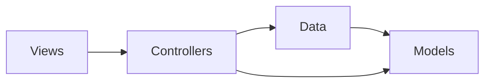

# Architecture Spine — MyContacts Birthday Reminder v1

## Design Paradigm

**Layered MVC** — ASP.NET Core MVC with three layers: Models (entity shape), Data (EF Core DbContext), Controllers (request handling + data access), Views (Razor presentation). Each layer depends only on layers below it; no layer may reach up.

```
Views  →  Controllers  →  Data (AppDbContext)  →  Models
```

Controllers own both routing and data access — no repository, no service layer. This is the existing convention; the birthday feature extends it without introducing a new layer.

## Invariants & Rules

### AD-1 — Layered MVC Paradigm [ADOPTED]

- **Binds:** all
- **Prevents:** two builders placing logic in different layers (birthday calculation in view vs controller; data access in model vs controller)
- **Rule:** All HTTP request handling lives in Controllers. All data access goes through `AppDbContext`. Views receive data from the controller and render only — no DB access, no business logic in `.cshtml`.

### AD-2 — Direct DbContext Access [ADOPTED]

- **Binds:** all controllers
- **Prevents:** one builder introducing a repository/service layer while another accesses `_db` directly, producing two incompatible access patterns
- **Rule:** Controllers inject `AppDbContext` via constructor and call it directly. No repository class, no service class for v1. `_db` is the canonical name for the injected context field.

### AD-3 — EnsureCreated Schema Management [ADOPTED]

- **Binds:** Program.cs, AppDbContext, all schema changes
- **Prevents:** partial schema states on an existing SQLite file breaking the app silently
- **Rule:** `db.Database.EnsureCreated()` in `Program.cs` manages schema. When the model changes, delete `mycontacts.db` and restart — `EnsureCreated` recreates it with the updated schema. Do **not** introduce `db.Database.Migrate()` in v1.

### AD-4 — Birthday Logic Encapsulated in Controller

- **Binds:** FR-2, ContactsController.Index
- **Prevents:** birthday calculation logic appearing in the Razor view, duplicated across actions, or moved into a separate class inconsistently
- **Rule:** Birthday window calculation lives in a private method `GetUpcomingBirthdays(IEnumerable<Contact> contacts)` on `ContactsController`. `Index()` calls it and passes the result to the view via `ViewBag`. No birthday logic in any `.cshtml` file.

### AD-5 — ViewBag for Cross-Concern View Data

- **Binds:** FR-2, ContactsController.Index, Views/Contacts/Index.cshtml
- **Prevents:** need for a ViewModel class that changes the view's `@model` declaration, or birthday data embedded inside `IEnumerable<Contact>`
- **Rule:** `ViewBag.UpcomingBirthdays` carries `List<(Contact contact, int daysUntil)>` from `Index()` to the view. The view's `@model` stays `IEnumerable<Contact>`. The banner reads from `ViewBag.UpcomingBirthdays`; the contacts table reads from `Model`.

### AD-6 — Year-Boundary-Safe Birthday Arithmetic

- **Binds:** FR-2, NFR-2, NFR-3, GetUpcomingBirthdays
- **Prevents:** Dec 28 → Jan 2 birthdays showing wrong days-away or being excluded; contacts with null DOB appearing in the banner
- **Rule:** For each contact with a non-null `DateOfBirth`, construct a candidate `DateTime` for the birthday in the current calendar year. If that date is before `DateTime.Today`, advance by one year. Compute `(candidate - DateTime.Today).Days`. Include the contact only if `0 ≤ days ≤ 6`. Contacts with null `DateOfBirth` are excluded before any date calculation.

## Consistency Conventions

| Concern | Convention |
| --- | --- |
| Naming — controllers | `{Entity}Controller` — e.g. `ContactsController` |
| Naming — fields | `_db` for injected `AppDbContext`; camelCase for locals |
| Naming — actions | PascalCase matching HTTP verb intent: `Index`, `Create`, `Edit`, `Delete`, `Details` |
| Data — nullable dates | `DateTime?` on the model; EF Core stores as SQLite TEXT (ISO 8601) |
| Data — date comparison | Always compare against `DateTime.Today` (server local date, date-only); never `DateTime.Now` |
| State mutation | All writes go through `_db.SaveChanges()` in POST actions only |
| Anti-forgery | `[ValidateAntiForgeryToken]` on every POST action — no exceptions |
| Not-found pattern | `if (entity == null) return NotFound();` immediately after `Find()` |
| Post-mutation redirect | `return RedirectToAction(nameof(Index));` after all successful mutations |
| ModelState | Check `if (!ModelState.IsValid) return View(model);` before any DB write in POST actions |

## Stack

| Name | Version |
| --- | --- |
| C# | 13 |
| .NET | 10.0 |
| ASP.NET Core MVC | 10.0 |
| EF Core (Sqlite provider) | 10.0.9 |
| SQLite | embedded via Microsoft.EntityFrameworkCore.Sqlite |
| Bootstrap | 5.3.3 (bundled in wwwroot/lib) |

## Structural Seed

```text
MyContacts/
  Controllers/            # HTTP routing + data access
    ContactsController.cs  # CRUD + GetUpcomingBirthdays() private method
    HomeController.cs
  Data/                   # EF Core context only
    AppDbContext.cs
  Models/                 # Entity shape; DataAnnotations for validation
    Contact.cs             # Add: DateTime? DateOfBirth
  Views/
    Contacts/              # One .cshtml per action
      Index.cshtml          # Add: birthday banner from ViewBag.UpcomingBirthdays
      Create.cshtml         # Add: DateOfBirth date input
      Edit.cshtml           # Add: DateOfBirth date input
      Details.cshtml        # Add: DateOfBirth display
      Delete.cshtml
    Shared/
      _Layout.cshtml        # Bootstrap 5.3.3 layout — unchanged
  wwwroot/lib/bootstrap/  # Bootstrap 5.3.3 static assets
  Program.cs              # DI wiring; EnsureCreated
  MyContacts.csproj
  appsettings.json        # Connection string: DefaultConnection → mycontacts.db
```

Dependency direction:



## Capability → Architecture Map

| Capability | Lives in | Governed by |
| --- | --- | --- |
| FR-1: DateOfBirth on Contact model | `Models/Contact.cs` | AD-1, AD-3 |
| FR-1: DateOfBirth Create/Edit forms | `Views/Contacts/Create.cshtml`, `Edit.cshtml` | AD-1 |
| FR-1: DateOfBirth Detail display | `Views/Contacts/Details.cshtml` | AD-1 |
| FR-1: Schema change (nullable column) | `Data/AppDbContext.cs`, `Program.cs` | AD-3 |
| FR-2: Birthday window calculation | `Controllers/ContactsController.GetUpcomingBirthdays()` | AD-4, AD-6 |
| FR-2: Birthday data → view | `ContactsController.Index()` via `ViewBag.UpcomingBirthdays` | AD-5 |
| FR-2: Birthday banner UI | `Views/Contacts/Index.cshtml` | AD-1, AD-5 |
| NFR-1: Additive-only schema | `Models/Contact.cs` (nullable `DateTime?`) + AD-3 | AD-3 |
| NFR-2: Server local date | `GetUpcomingBirthdays()` uses `DateTime.Today` | AD-6 |
| NFR-3: No false positives | `GetUpcomingBirthdays()` null-check before date calc | AD-6 |
| NFR-4: No page load delay | Single in-memory LINQ pass on already-fetched contact list | AD-4 |

## Deferred

- **EF Core migrations** — switch `EnsureCreated()` to `Migrate()` when real contact data accumulates and schema can't be thrown away
- **Repository / service layer** — not warranted for a single-table personal app; revisit if the app grows to multiple modules (Personal Life OS phases)
- **Typed ViewModel** (`ContactsIndexViewModel`) — ViewBag is sufficient for v1; introduce when the Index view needs a third data source or type-safety matters
- **Multi-user / auth** — deferred to a future phase; all data is single-owner in v1
- **DPDP compliance** — deferred; relevant when multi-user or cloud deployment is introduced
- **PostgreSQL** — deferred; SQLite is correct for a single-user local app
